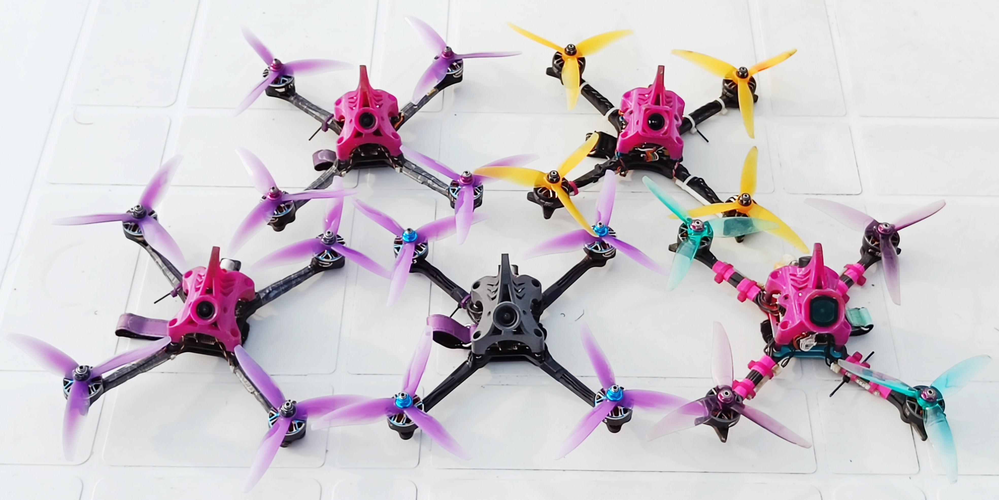
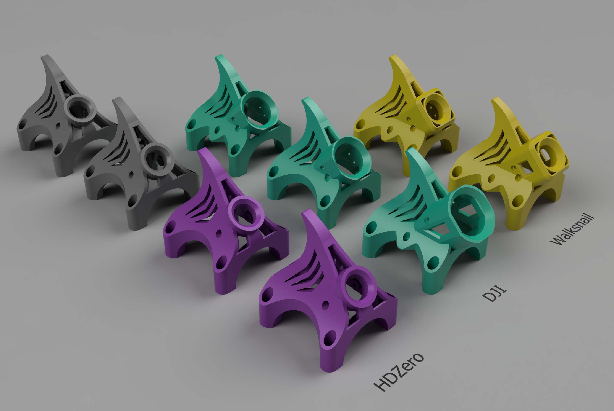
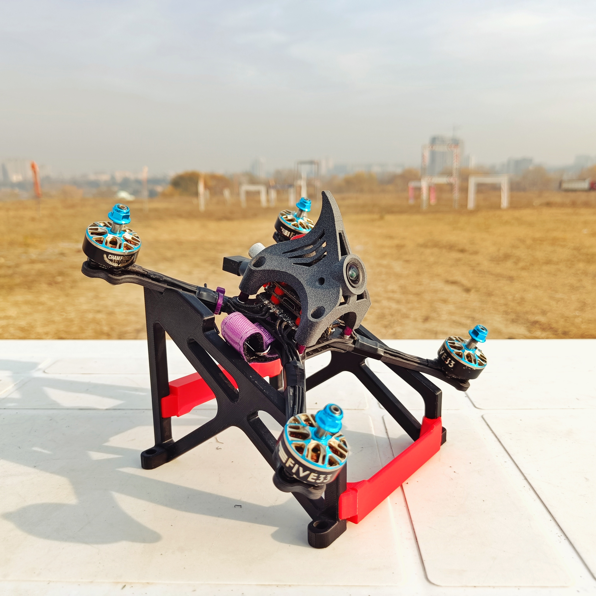
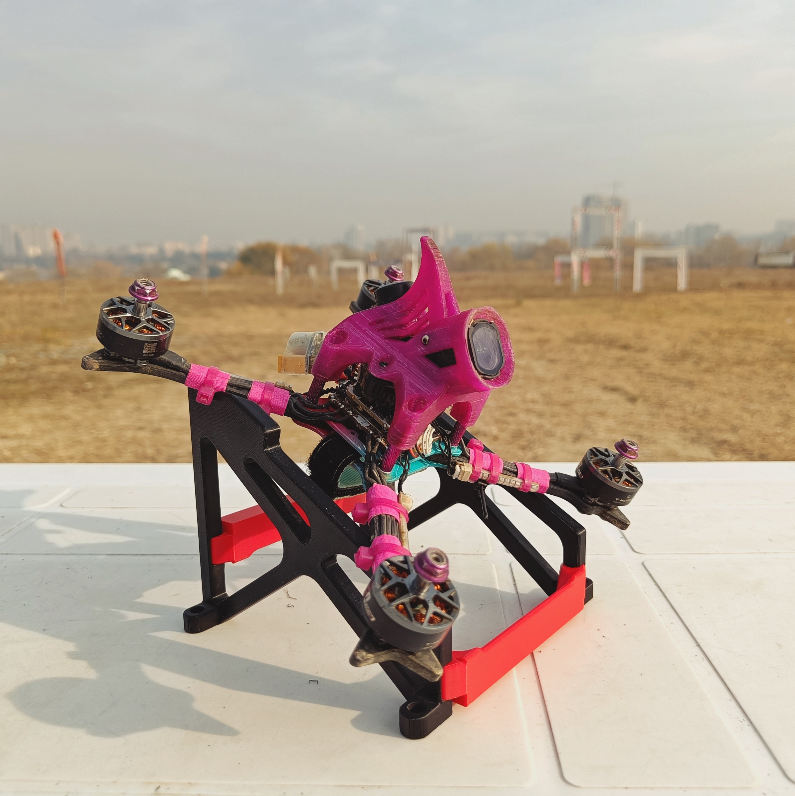
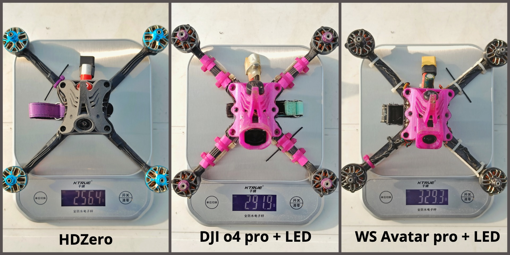
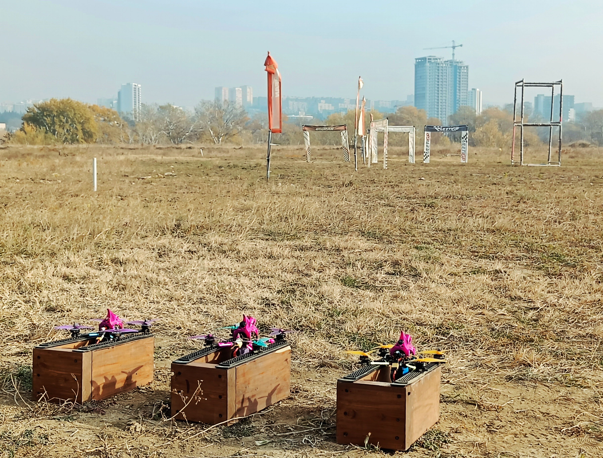

# JazzMutant's OpenRacer Light



## Overview

The **JM OpenRacer Light** is a fully backward-compatible lightweight version of the original OpenRacer frame, designed for pilots who want reduced weight without sacrificing durability or maintainability. This version maintains full mounting compatibility with standard OpenRacer parts while implementing optimizations in the carbon structure.

This frame works best with the "OpenRacer 5 6S by JazzMutant" Betaflight preset for optimal performance.


## Canopies 



This frame works with all existing OpenRacer canopies. In addition, **@jares13** have disigned the **Shark Canopies** which are lighter than the standard designs and remain extremely durable. They also feature an integrated fin for turtle‑mode recovery.

### Options
```
- HDZero Race V3 + Nano 90 v2 + Rush Cherry v2. (45° or 55°)
- DJI O3 (45°)
- DJI O4 light + O3 lens (45°)
- DJI O4 pro + O3 antenna (45°)
- Walksnail Avatar Pro (45°)
- Walksnail Avatar v2 (45°)
```

If you need more canopy variants for specific hardware or personal preference, a **Fusion 360 project** is provided to let you customize or generate additional designs.

### Printing Recommendations

All canopies for the Light frame should be printed in **95A TPU**.
There is also an HDZero version optimized for PA-11 nylon which is thinner and lighter. For nylon printing, services such as PCBWay and JLC3DP are recommended.


## Hardware Specifications

### Carbon

```
Top Plate:          2mm
Bottom Plate:       2mm
Arms:               5mm
Braces (optional):  3-4mm
```

**Important**: All carbon components should be **T700 carbon fiber** to compensate for the reduced thickness and ensure optimal strength-to-weight ratio. Braces are optional and can be either 3mm or 4mm thick depending on your build preference.

### Required Hardware

**HDZero Race V3 with 20x20 stack**

```
8 psc   M3 pressnuts (for top plate)
4 psc   M3 nut (for stack screws. Titanium)
4 psc   M3x25mm button head screw (for stack mounting. Titanium)
4 psc   M3x10mm countersunk screw (for arm mounting. 12.9 grade alloy steel)
4 psc   M3x16mm countersunk screw (for arm and standoff mounting. 12.9 grade alloy steel)
4 psc   M3x6mm button head screw (for canopy mounting. Titanium)
12 psc  M3x8mm button head screw (for motors mounting. Titanium)
4 psc   M3x10mm standoff.
```

**DJI/Walksnail with 20x20 stack**

```
8 psc   M3 pressnuts (for top plate)
4 psc   M3 nut (for stack screws. Titanium)
4 psc   M3x18mm button head screw (for stack mounting. Titanium)
4 psc   M3x10mm countersunk screw (for arm mounting. 12.9 grade alloy steel)
4 psc   M3x16mm countersunk screw (for arm and standoff mounting. 12.9 grade alloy steel)
4 psc   M3x6mm button head screw (for canopy mounting. Titanium)
12 psc  M3x8mm button head screw (for motors mounting. Titanium)
4 psc   M3x15mm standoff.
```

**Optional hardware**
```
8 psc   M3x12mm button head screw (for motor mounting if you use braces)
8 psc   M3x28mm countersunk screw (for arm and stack mounting if you use 30x30 stack. 12.9 grade alloy steel)
4 psc   M2x12mm button head screw (for AIO mounting)
```

**Notes:**
- Use 12.9 grade alloy steel for arm mounting. Anything else would not work.
- Titanium is recommended for best weight savings but can be replaced with steel.


## Reference Builds

> **Disclaimer:** these example builds are provided for illustration only and use different component sets; they should not be treated as directly comparable or definitive "best" configurations.



### HDZero

- Frame: JM OpenRacer Light
- Stack: Oxbot Champ (20×20)
- Motors: Five33 2207 2070 KV
- Camera: HDZero Nano 90 V2
- VTX: HDZero Race V3
- Antenna: Rush Cherry V2
- RC: Radiomaster XR1
- Canopy: Shark Canopy (Nylon)

**Weight: 256.4g**

---

### DJI O4 Pro

- Frame: JM OpenRacer Light
- Stack: HDZero Halo (20×20)
- Motors: T-Motor F50 2207 2150 KV
- Camera: DJI O4 Pro
- VTX: DJI O4 Pro
- Antenna: DJI O3
- Canopy: Shark Canopy (95A TPU)
- Other: HGLRC LED Kit

**Weight: 291.9g**

---

### Walksnail Avatar Pro

- Frame: Default OpenRacer (steel hardware)
- Stack: SpeedyBee V4 (30×30)
- Motors: iFlight XING E-Pro 2207 2450 KV
- Camera: Walksnail Avatar Pro
- VTX: Walksnail Avatar Pro
- Antenna: Walksnail
- RC: Happymodel EP1
- Canopy: Shark Canopy (95A TPU)
- Other: LED Kit

**Weight: 329.3g**
This is a temporary file containing the Flight Videos section to append to the README.


## Flight Videos



Here are some flight footages from our practice sessions:
- [Sunday Mayhem](https://youtu.be/KUW6h_FZijc)

- [NIGHT PRACTICE](https://youtu.be/jPU3IjdKNmI)
